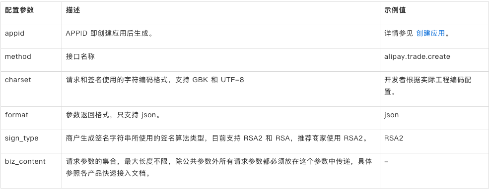
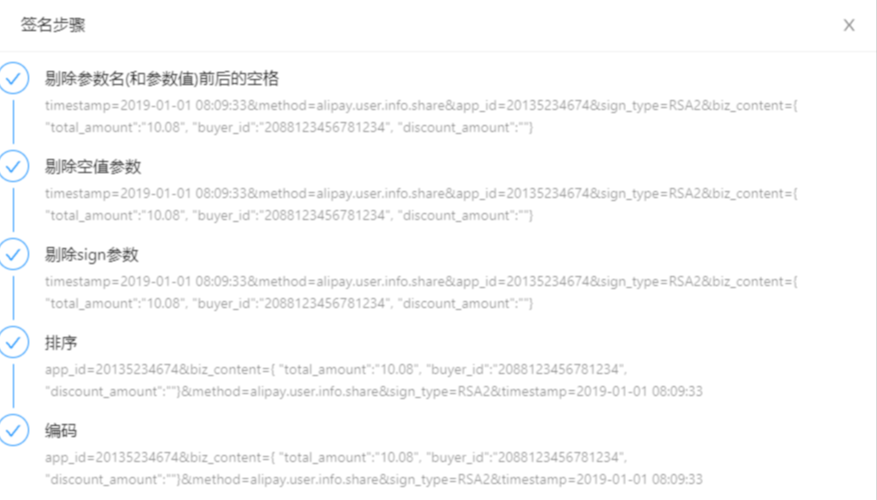

# 签名模块

- [微信签名](https://pay.weixin.qq.com/wiki/doc/api/micropay.php?chapter=4_3)
- [支付签名](https://opendocs.alipay.com/common/02khjm)
- [银联签名](https://open.unionpay.com/tjweb/api/interface?apiSvcId=488&id=321)

## 支付宝签名

- 请求报文

````
timestamp=2019-01-01 08:09:33&method=alipay.trade.create
&app_id=20135234674&sign_type=RSA2&biz_content={"total_amount":"10.08", "buyer_id":"2088123456781234", "discount_amount":""}
````

- 参数
  

- 签名步骤
  

## GET 示例

````
http://localhost:8080/signTest?sign=A0161DC47118062053567CDD10FBACC6&username=admin&password=admin
````

A0161DC47118062053567CDD10FBACC6 是 username=admin&password=admin MD5加密后的结果。

## POST 示例1

请求Url为 http://localhost:8080/signTest?sign=A0161DC47118062053567CDD10FBACC6 参数为

````
{
    "username":"admin",
    "password":"admin"
}
````

## POST 示例2

签名都在 request body中 使用这种方式时，需要注意 request body流只能读取一次

````
    CloseableHttpClient client = HttpClients.createDefault();
    
    // appid
    String appid = new String("a00000000000000000000000000000001");
    
    // secret秘钥
    String secret = new String("2aaaaaaaaaaaaaaaaaaaaaaaaaaaaaa0");
    
    // json方式
    JSONObject jsonParam = new JSONObject();
    jsonParam.put("appId", appid);
    // 生成随机字符串
    String str = Utils.createNonceStr();
    jsonParam.put("nonceStr", str);
    
    // 时间戳
    String date = String.valueOf(System.currentTimeMillis() / 1000);
    jsonParam.put("timestamp", date);
    
    // 生成签名
    String waitSign = "appId=" + appid + "&nonceStr=" + str + "&secret=" + secret + "&timestamp=" + date;
    String sign = Utils.sha256(waitSign.getBytes());
    jsonParam.put("signature", sign);
    System.out.println(jsonParam.toString());
    
    // 解决中文乱码问题
    StringEntity entity = new StringEntity(jsonParam.toString(), "utf-8");
    entity.setContentEncoding("UTF-8");
    entity.setContentType("application/json");
    
    httpPost.setEntity(entity);
    
    String respContent = null;
    HttpResponse resp = client.execute(httpPost);
    
    if (resp.getStatusLine().getStatusCode() == 200) {
       HttpEntity he = resp.getEntity();
       respContent = EntityUtils.toString(he, "UTF-8");
    }
````